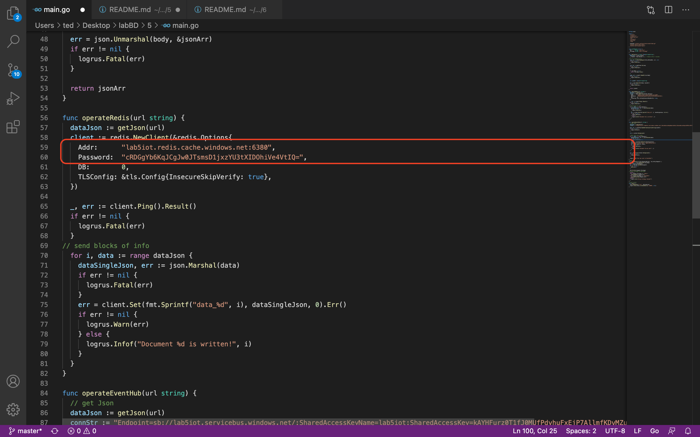
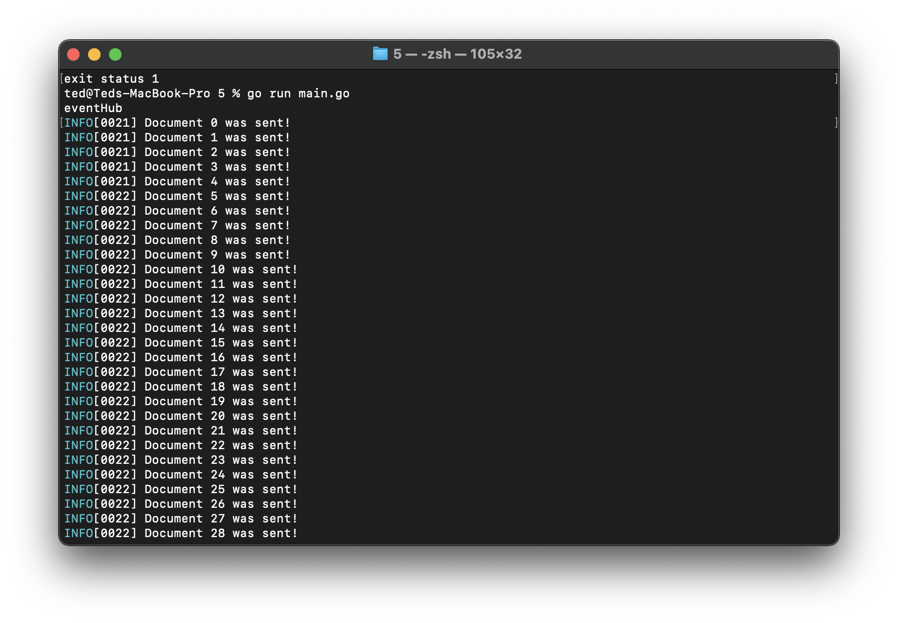
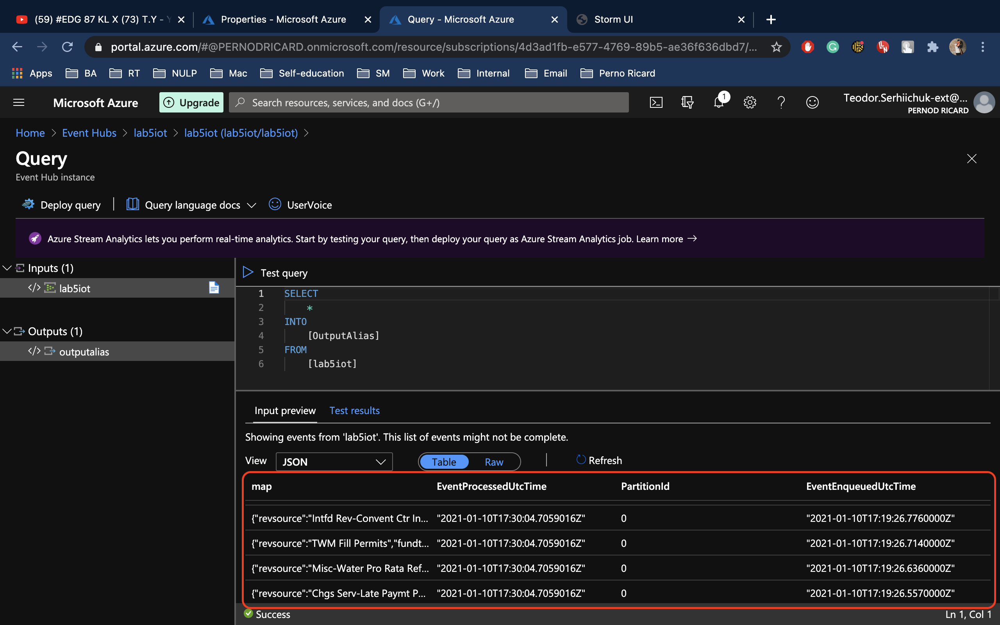

# 5
1. Create res group (Note! Recommended to pick WEST EUROPE region)

2. Create Azure cash for Redis(the same region as res group). Wait till status "running"

3. Create an Event hub  
 * 3.1 Press the button "+ Event hub"(img1). It would create the instance.
 
 * 3.2 Find your innctance in "Entetis -> Evevnt hub" 
 * 3.3 Create new Share access policies (img2). (Note! select "Manage" config while creating access policies to avoid further errors)
 

4. Paste your data from the Share access policies -> Connection string–primary key into 


5. Go "Redis" -> "Access keys". Paste your data from Access keys into the code 


6. From terminal go to your folder and start "go" file ```make``` (go run main.go)


7. Start Postman and post your JSON file URL (Note! check the ports 9000 or 10000)
* 7.1 Start sending POST request into the "eventHub" (img6)


* 7.2 You could notice some "Documents" stream in the terminal (img7)


*  7.3 Go to the Event hub -> Process data -> Explore. Wait till refreshing. Here you can see proof that your data has been written (img8)


*  7.4 Start sending POST request into the "redis"(img9)


*  7.5 You could find that there are different types of requests are coming through your terminal.
*  7.6 Go to the "Azure cache for Redis" -> your instance -> "console" button. Write "hgetAll ConsoleLog"(img10)(Note! carefull with console comand naming.)


