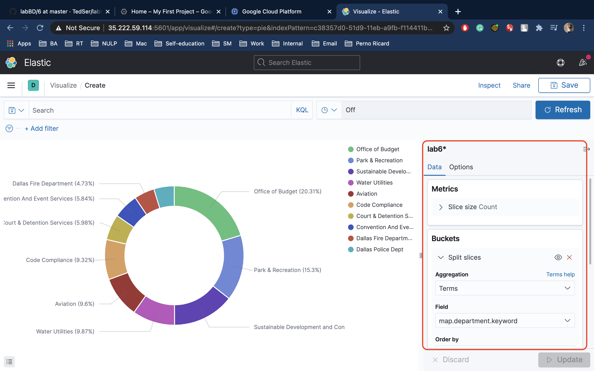
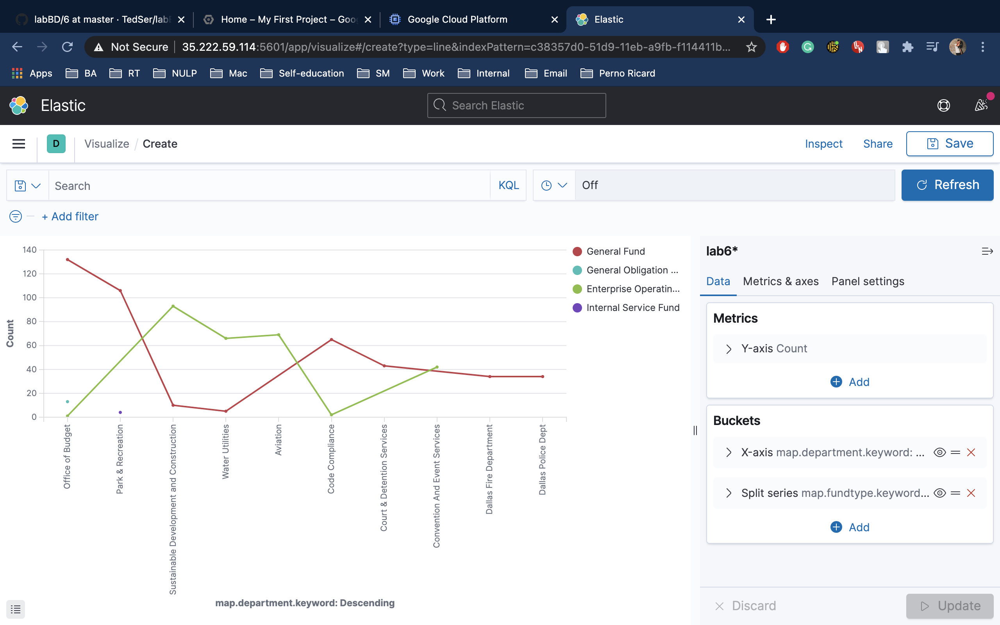
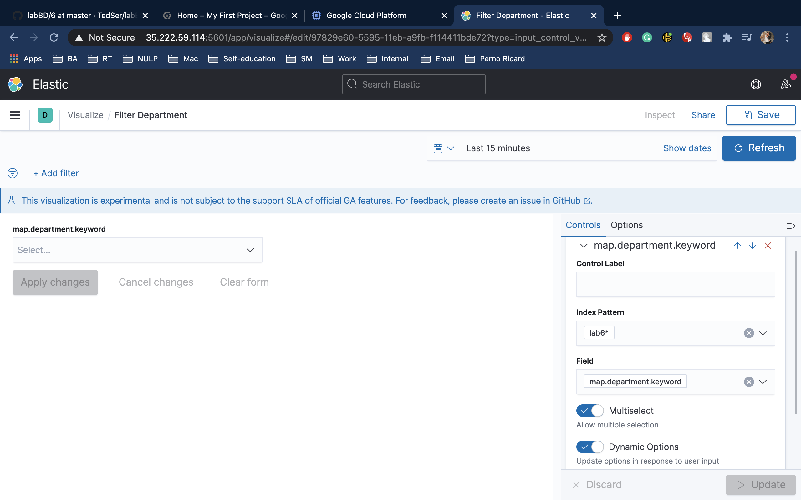
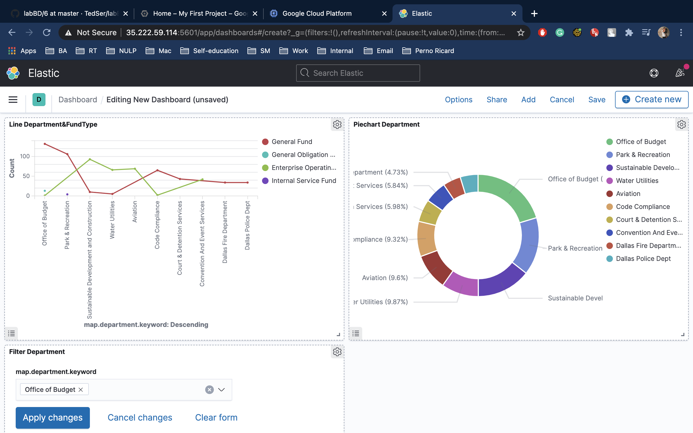

# 7

1. Go to Kibana -> Visualise -> Create visualization

2. Select "Pie" chart and next choose your source

3. Add a bucket with "split slice" settings and aggregation "terms"

* 3.1 add your field 
* 3.2 customize your chart
* 3.3 save

4.  Crate new visualisation as in step 1 
 
5. Select "Line" chart and next choose your source

6. Add a bucket with "X-axis" settings and aggregation "terms"

* 6.1 add your field 
* 6.2 customize your chart
* 6.3 save

7. Crate new visualisation as in step 1  

8. Select "Controls" chart and next choose your source

9. Select option list and choose your source in "Index pattern" dropdown

* 9.1 add your field 
* 9.2 customize selection
* 9.3 save

10. Go to Kibana -> Dashboards -> Create dashboard 

11. Add created charts

